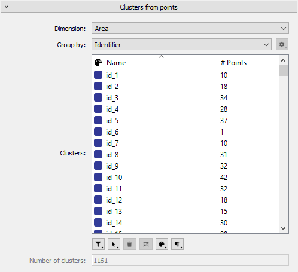

# Clusters from points plugin

This analysis plugin is used to derive clusters from points using various extraction algorithms. Points are grouped (clustered) based on their numerical value for a user specified dimension. In its current state, the point values can be grouped by:
  - their rounded numerical value (Identifier)
  - their point index (Index)
  - in which interval they fall (Stratification)
  - a user defined interval (Interval)

## Usage
This plugin produces a single clusters dataset and continuously updates the clusters as parameters are changed. Please follow these steps to generate clusters:
- Right-click a points dataset in the data hierarchy
- Choose Analyze > Extract clusters from points
- Enter the name of the target clusters dataset
- Choose the extraction dimension
- Pick a grouping algorithm
  - If the algorithm has editable parameters, click the cog icon to the right of the grouping algorithm to edit them

## Building
### Requirements
* Git (https://git-scm.com/)
* CMake 3.12+ (https://cmake.org/)
* Qt 5.15.1 (https://www.qt.io/download)
* Visual Studio 2017+ (Windows https://visualstudio.microsoft.com/downloads/)

### Building
1. Launch CMake (available here: https://cmake.org/)
2. In the source code field browse to the local folder from the last section (which contains CMakeLists.txt).
3. In the build field copy the source code field but append `/Build` at the end. This will put all files necessary for building in the `Build` folder (it will create it if it doesn't exist).
4. Press `Configure` and select the generator for your IDE of choice with the platform of `x64`. Press Finish to configure the project.
5. A lot of red paths should now appear. Check that the ones pointing to Qt directories seem correct and then press `Generate` to generate the solution for your given IDE.
6. Press `Open Project` to launch the IDE and the project.

## Compilation

## Windows
1. At the top of Visual Studio set the build mode (where it says `Debug`) to `Release`.
2. Right click the solution and press `Build Solution`, if this does not produce errors, continue to the next step.
2. Right click the project `HDPS` in the Solution Explorer and select Set as StartUp Project.
3. Right click the project again and select Properties.
4. In the Configuration Properties -> Debugging set the `Command` to `HDPS.exe`. Set the `Working Directory` to `$(HDPS_INSTALL_DIR)/Release`.
5. Press Apply and OK and right click the project in the Solution Explorer and press Build.
6. If all is well the build should succeed and if you run the project with Ctrl+F5 it will launch `HDPS.exe`.

## Linux | Mac
This depends on your IDE / compiler. Follow their instructions for compiling source code.

## Notes
After first time compiling on macOS it might be necessary to manually moc the MainWindow.ui file:
