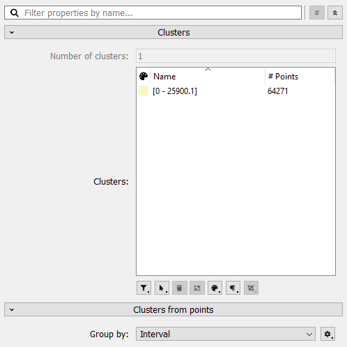

# Clusters from points plugin

This analysis plugin is used to derive clusters from points using various extraction algorithms. Points are grouped (clustered) based on their numerical value for a user specified dimension. In its current state, the point values can be grouped by:
  - their rounded numerical value (Identifier)
  - their point index (Index)
  - in which interval they fall (Stratification)
  - a user defined interval (Interval)

## Usage
This plugin produces a single clusters dataset and continuously updates the clusters as parameters are changed. Please follow these steps to generate clusters:
- Right-click a points dataset in the data hierarchy
- Choose Analyze > Extract clusters from points
- Enter the name of the target clusters dataset
- Choose the extraction dimension
- Pick a grouping algorithm
  - If the algorithm has editable parameters, click the cog icon to the right of the grouping algorithm to edit them
